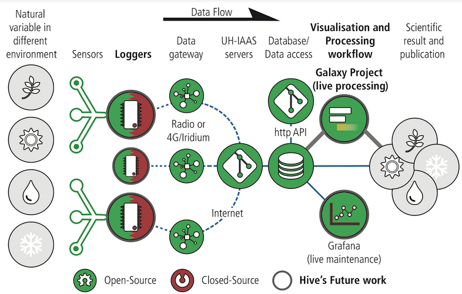

# Introduction

Welcome to the documentation of the Hive Wireless Sensor Network (Hive WSN) system developed at Department of Geosciences of the University of Oslo. The Hive WSN consists of a system to collect data in remote and cold regions using the technology available thanks to the Internet of Things (IoT) industry. This system is build to the maximum extent on open-source technology .

This documentation intends to provide as much information as possible on the functionning of the entire system for transparency towards the end user of the data. You will find a section describing the hardware

## Deployed Network
We currently have two test sites, one in mainland Norway, and another one in Ny-Ålesund, Svalbard. Data from the network in Svalbard will be available freely through the SIOS portal.

### Finse, Norway
The network in Finse is primarily a test ground for the equipment before being send elsewhere. The network is spread around the [research station of Finse.](https://www.finse.uio.no/). Data are available upon request.

Due to the very harsh weather, the network is currently partly functionning.

### Norwegian Permafrost Borehole
Hive WSN stations equip 4 permafrost borehole spread across the norwegian mountains to record ground temperatures.

### Ny-Ålesund, Svalbard Archipelago
Our largest network is deployed aroud the region of Ny-Ålesund in Svalbard. It is currently spread over two glaciers Kongsvegen, and Midtre-Løvenbreen (aka. two sub networks). The networks are pushing data to the servers 

General view

Kongsvegen glacier sub network as of 2021:

Midtre Løven glacier sub-netwrok as of 2021:

## Financial Support

This development is supported by the eInfrastructure hub [UiO Hive](https://www.mn.uio.no/geo/english/research/projects/hive/), and implemented to collect data on the archipelago of Svalbard in collaboration with the [Norwegian Polar Institute](https://www.npolar.no/en/). Additional support from [SIOS](https://sios-svalbard.org/). 

